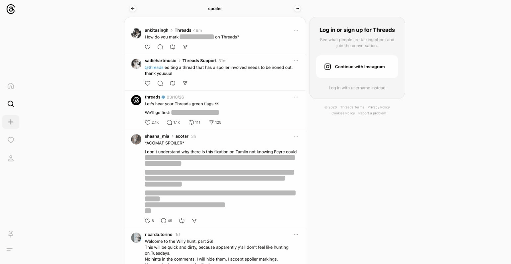

# Threads Spoiler Revealer

<p align="center">
  
</p>

<p align="center">
  <strong>Auto-reveal all spoiler content on Threads.</strong><br/>
  No more clicking gray bars to read hidden text.
</p>

---

## The Problem

Threads lets users hide text behind spoiler tags - gray bars that require a click to reveal. If you follow topics like TV shows, sports, or books, your feed is full of these and you have to tap each one individually.

## The Solution

This extension automatically reveals all spoiler content the moment it loads, so you can read your feed naturally.

<p align="center">
  
</p>

Posts that contained spoilers are subtly marked with a thin purple left border and a small eye icon, so you still know which content was originally hidden - without disrupting your reading flow.

## Features

- **Instant reveal** - Spoiler text is shown immediately, no clicks needed
- **Media support** - Also removes blur filters from spoiler images and videos
- **Post-level indicator** - Subtle left border marks posts that contained spoilers (one per post, not per spoiler block)
- **Infinite scroll aware** - New posts are revealed as you scroll
- **SPA navigation** - Works across page transitions within Threads
- **Toggle on/off** - Disable from the popup anytime, re-enables spoilers instantly
- **Indicator toggle** - Choose whether to show the spoiler post markers
- **Dual detection** - Uses both CSS class matching and structural analysis for resilience against Threads code changes

## Install

### From source (development)

```bash
# Clone the repo
git clone https://github.com/toanbku/threads-spoiler.git
cd threads-spoiler

# Install dependencies
pnpm install

# Start dev mode (opens Chrome with extension auto-loaded + hot reload)
pnpm dev
```

### Manual install

```bash
pnpm build
```

Then in Chrome:
1. Go to `chrome://extensions`
2. Enable **Developer mode** (top right)
3. Click **Load unpacked**
4. Select the `.output/chrome-mv3/` directory

### Firefox

```bash
pnpm build:firefox
```

Then load `.output/firefox-mv2/` as a temporary add-on in `about:debugging`.

## How It Works

Threads spoiler mechanism:
- A `div[role="button"]` with a gray background (`rgb(184,184,184)` light / `rgb(54,54,54)` dark)
- Inside: a child `div` with `opacity: 0` that hides the text
- Clicking sets opacity to 1 and removes the background

The extension:
1. **CSS injection** (fast path) - Targets known spoiler class (`xt0psk2`) to instantly override `opacity` and `background-color` at the paint level
2. **Structural detection** (fallback) - Finds `div[role="button"]` elements containing a child with `opacity: 0` and a gray background, resilient to class name changes
3. **MutationObserver** - Watches for new DOM nodes (infinite scroll, dynamic content)
4. **Post deduplication** - Walks up the DOM to find the post container and only adds one indicator per unique post URL

## Project Structure

```
threads-spoiler/
├── entrypoints/
│   ├── content.ts          # Content script - spoiler detection & reveal logic
│   └── popup/
│       ├── index.html      # Popup entry point
│       ├── main.ts         # Popup logic (toggles, stats)
│       └── style.css       # Popup styles
├── public/
│   └── icon/               # Extension icons (16-128px + SVG source)
├── assets/
│   └── screenshots/        # README images
├── wxt.config.ts           # WXT configuration
├── package.json
└── tsconfig.json
```

## Tech Stack

- [WXT](https://wxt.dev/) - Next-gen browser extension framework
- TypeScript
- Chrome Extension Manifest V3

## Scripts

| Command | Description |
|---------|-------------|
| `pnpm dev` | Start development with hot reload |
| `pnpm build` | Production build for Chrome |
| `pnpm build:firefox` | Production build for Firefox |
| `pnpm zip` | Package for Chrome Web Store |
| `pnpm compile` | TypeScript type checking |

## License

MIT
